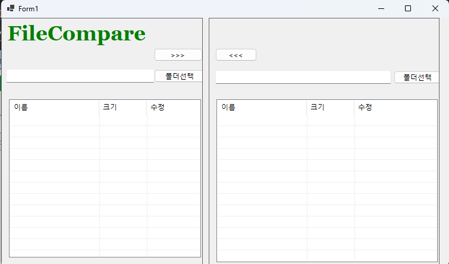

# (C# 코딩) 에코 메신저
## 개요
- C# 프로그래밍 학습
- 1줄 소개: 사용자 키보드 입력을 받아서 처리하는 프로그램
- 사용한 플랫폼: 
- C#, .NET Windows Forms, Visual Studio, GitHub
- 사용한 컨트롤:
- Label, TextBox, ListBox, Button
- 사용한 기술과 구현한 기능:
- Visual Studio를 이용하여 UI 디자인
- string 클래스를 이용한 사용자 입력 데이터 처리
- DateTime 클래스를 이용한 현재시간 정보 구하기
- ## 실행 화면 (과제1)
- 코드의 실행 스크린샷과 구현 내용 설명

- 구현한 내용 (위 그림 참조)
- UI 구성 : Label(앱 이름 표시), TextBox 2개(아이디, 패스워드) 
- Placeholder 표시 : 아이디와 패스워드 입력 힌트를 입력창 안에 회색으로 표시
- 로그인 버튼 : 아이디와 패스워드가 모두 맞아야 로그인 허용
## 실행 화면 (과제2)
- 코드의 실행 스크린샷과 구현 내용 설명

- 구현한 내용 (위 그림 참조)
- 패스워드 입력 내용 숨기기 : UseSystemPasswordChar 속성 이용
- Placeholder 메시지를 표시할 때는 UseSystemPasswordChar 없애기
- ## 실행 화면 (과제3)
- 코드의 실행 스크린샷과 구현 내용 설명

- 구현한 내용 (위 그림 참조)
- UI 구성 : Label(앱 이름 표시), TextBox 2개(아이디, 패스워드) 
- Placeholder 표시 : 아이디와 패스워드 입력 힌트를 입력창 안에 회색으로 표시
- 로그인 버튼 : 아이디와 패스워드가 모두 맞아야 로그인 허용
## 실행 화면 (과제4)
- 코드의 실행 스크린샷과 구현 내용 설명

- 구현한 내용 (위 그림 참조)
- 패스워드 입력 내용 숨기기 : UseSystemPasswordChar 속성 이용
- Placeholder 메시지를 표시할 때는 UseSystemPasswordChar 없애기